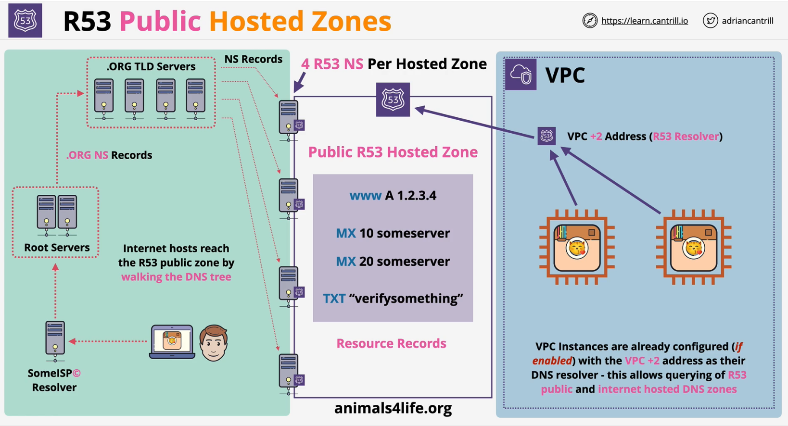
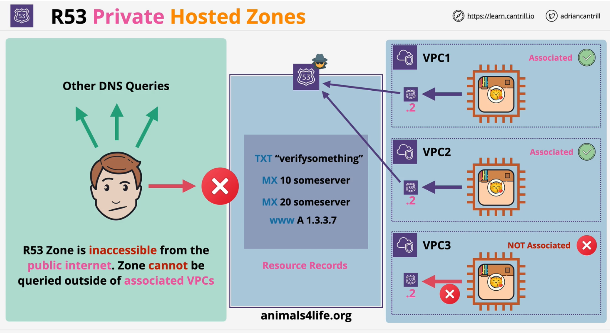
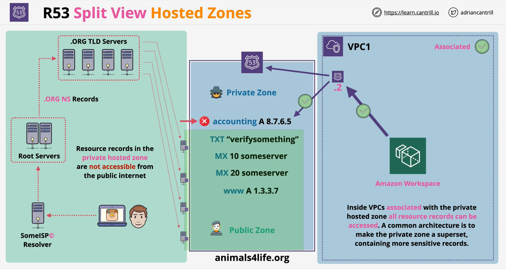

### Overview
- A **R53 Hosted Zone** is a DNS DB for a domain e.g. myorg.org
- **Globally resilient** (multiple DNS servers)
- Created with domain registration via R53 (also can be created seperately)
- Host **DNS Records** (e.g A, AAAA, MX, NS, TXT...)
- Hosted Zones are what the DNS sytem refrences - **Authoritative** for a domain e.g. myorg.org

### Public Hosted Zone
- DNS Database (**zone file**) hosted by R53 (**Public Name Servers**)
- Accessible from the public internet
  - as well as from **VPCs** using R53 Resolver
- Hosted on `4` R53 Name servers (**NS**) specific for the zone
  - use `NS records` to point at these **NS** (connect to global DNS)
- Resource Records (**RR**) created within the Hosted Zone
- Externally registered domains can point at R53 Public Zone

### Private Hosted Zone
- A Public Hosted zone which is not public
- Associated with **VPCs**
    - only  accessible in those **VPCs**
    - using **different accounts** is supported via CLI/API

- Split-view (overlapping **public** and **private**) for **PUBLIC** and **INTERNAL** use with the same one name

### Split View Hosted Zones
- Records in the private hosted zone are not accessible from the public internet
- Hosted zone associated with VPCs are accessible within the VPCs

### R53 CNAME vs ALIAS
- `A` maps a `NAME` to an IP address
    - like **catagram.ip => 1.2.3.4**
- `CNAME` maps a `NAME` to another `NAME`
    - like **www.catagram.io => catagram.io**
- `CNAME` is invalid for naked/apex
- Many AWS services uses a DNS name (ELBs)
- With just `CNAME` - catagram.io => ELB would be invalid

**Alias Records**

- **ALIAS** records map a `NAME` to an AWS resoruce
- Can be used both for `naked/apex` and `normal` records
- For non `apex/naked` - functions like `CNAME`
- For `AWS Services` -**default** to picking **ALIAS**
- Should be the same `Type` as what the record is pointing at
- API Gatewy, Cloudfront, Elastic Beanstalk, ELB, Global Accelerator & s3
