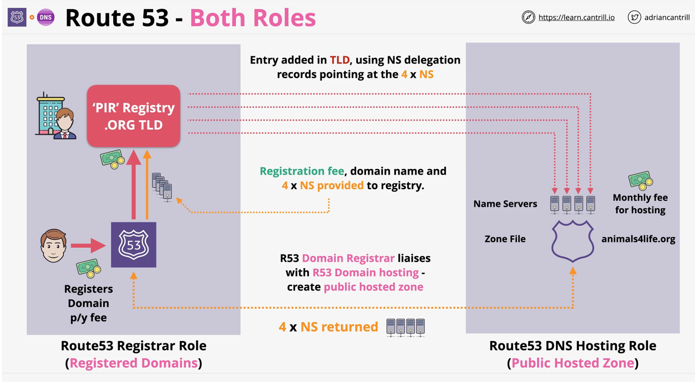
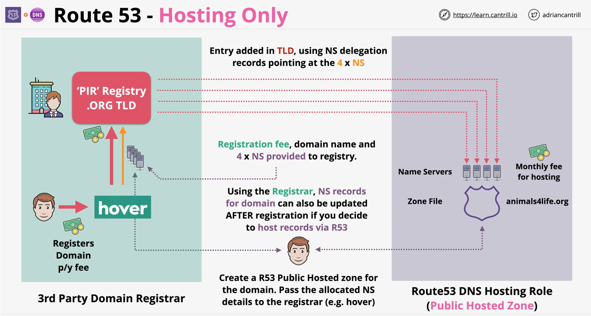

### Route53 Health Checks
- Health Checks are created and configured seperately
    - Records an use it for routing
- Health Checkers are located globally
- Interval - every 30s (reduce to 10s for extra cost)
- Supports multiple method of health checks
    - Endpoint: Ip, TCP (2s), HTTP/HTTPS (2s + 2s body) string matching
    - Cloudwatch alarms
    - Other health checks - checks of checks
   
### Simple Routing
- Supports 1 record per NAME
- 1 record can have multiple values
- Single value is returned randomly
- DOES NOT SUPPORT HEALTH CHECKS

### Failover Routing
- Active/passive failover
  - health check on primary record and failover to secondary record if health check is failing on primary record

### Multi-Value Routing
- Multiple records with same name
    - each record is independent and can have an associated health check
- NOT THE SUBSTITUTION FOR LOAD BALANCER
- Upto 8 healthy records can be retured to client (> 8 records - randomized 8)
    - unhealthy records are not returned
  
### Weighted Routing
- Simple load balancing with weights
  - helpful for testing new software versions
- control the distribution for same record
  
### Latency-Based Routing
- Optimze performance and user experience
- **AWS** maintain database of **latency** to redirect traffic to record with **least latency**
    - health check can be associated with routes to ensure healhty routes are returned
  
### Geolocation Routing
[R53 Geolocation Docs](https://docs.aws.amazon.com/Route53/latest/APIReference/API_GeoLocation.html)
- Relevant (**location**) records
    - **State** - SubdivisionCode | SubdivisionName (only for US)
    - **Country** - CountryCode | CountryName
    - **Continent** - ContinentCode | ContinentName
    - **Default**

- Cane be used of **regional restrictions**, **language specific** content or **load balancing across regional endpoints**

### Geoproximity Routing
- Records can be tagged with an **AWS Region** or **lat** and **long** cordinates
- Routing is distance based but can be influence with **bias**
  - `+` or `-` bias can be added to rules to increase a region size.

### Route 53 Interoperability
- **Domain registrar** or **Domain Hosting**

