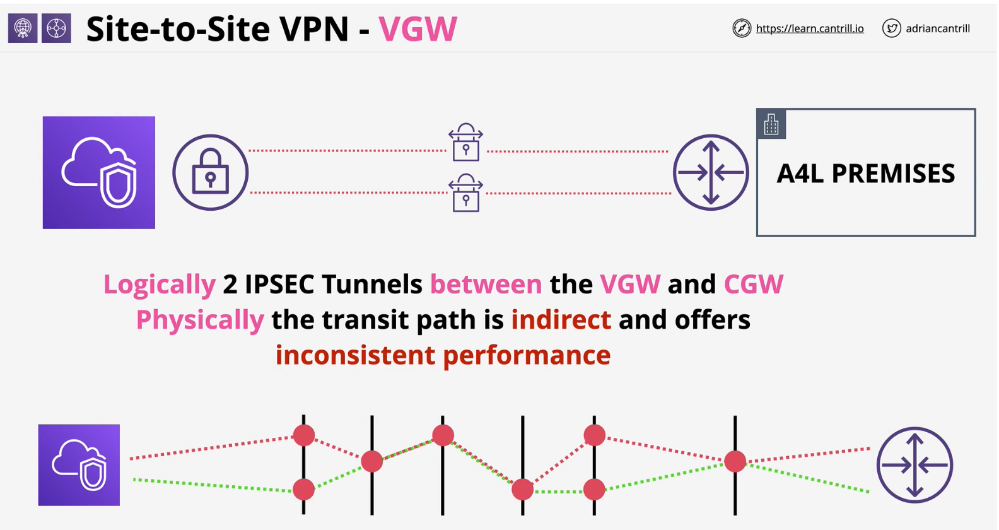
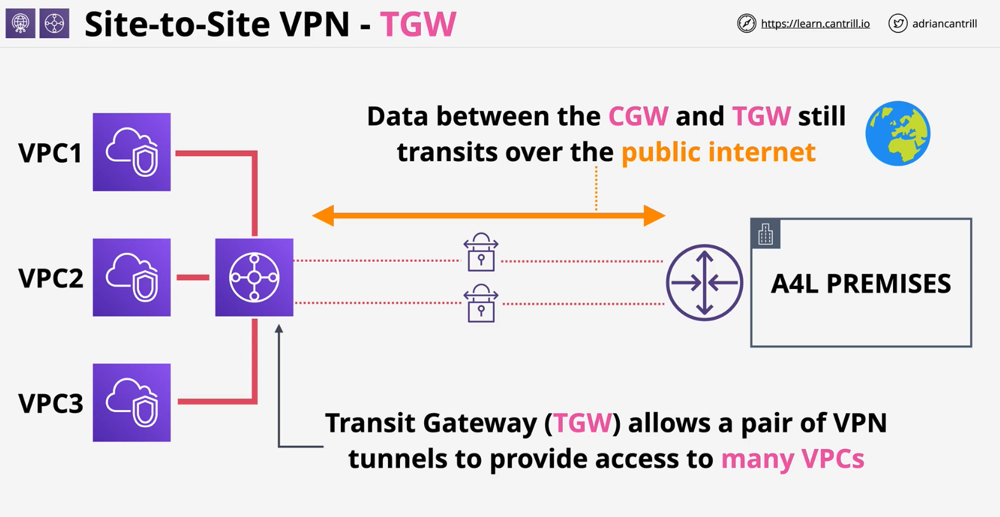
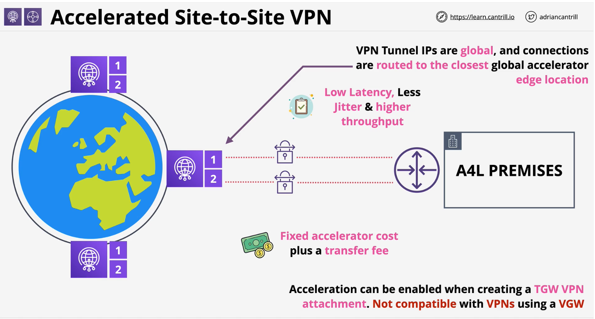
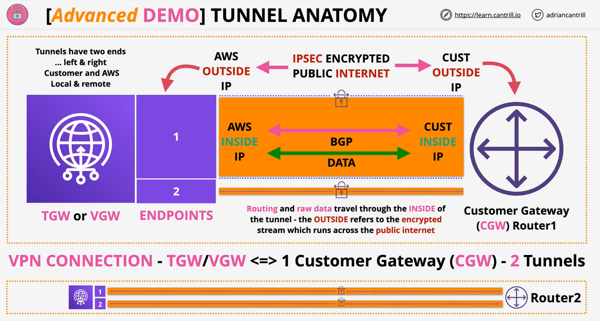

### Accelerated Site-to-Stie VPN
Accelerated VPN provides performance enhancements by routing traffic over a more direct and efficient path between CGW and AWS, avoiding the public internet as much as possible.

- Runing Direct Connect could be expensive for businesses

- Accleration can be enabled when creating a **TGW VPN** attachment. **Not compatible** with **VPNs** using a **VGW**
    - fixed accelarator cost + a transfer fee

- AWS Network has been extended closer to your premises so the benefits appear earlier
    - the traffic will only be in public internet when connecting between CGW and edge locations.

 
 

### DEMO

Router1Private	192.168.12.154	Private IP of Router1	-
Router1Public	3.85.143.209	Public IP of Router1	-
Router2Private	192.168.12.52	Private IP of Router2	-
Router2Public	54.89.189.79	Public IP of Router2	-

- Create 2 CGW for 2 routers on AWS using their public address. 
- Create 2 TGW attachement for VPN using the CGW ids
    - TGW-VPN attachment creates 2 tunnels between TGW and CGW
        - in AWS they are two endpoints created in 2 different AZs
    - while creeating TGW attachment enable Acceleration
    - improves performance of VPN tunnels via AWS Global Accelerator and the AWS global network

- SiteToSite VPN  from TGW <--> will be in the pending state