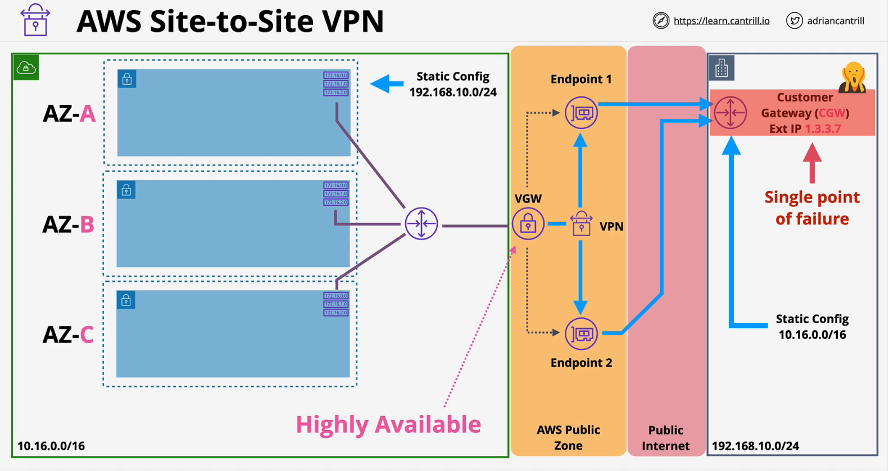
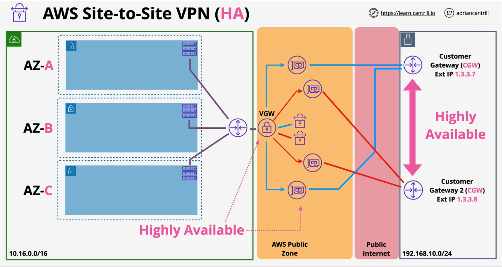
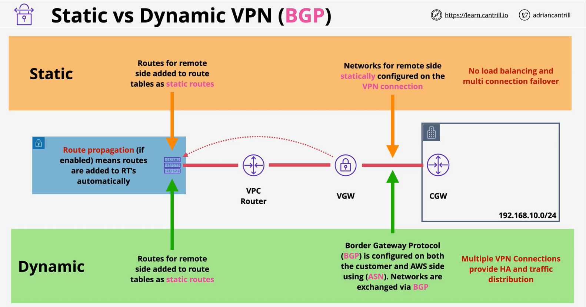

AWS Site-to-Site VPN is a hardware VPN solution which creates a highly available IPSEC VPN between an AWS VPN and external network such as on-premises traditional networks

### Overview
- A logical connection between a **VPC** and **on-premise network** encrypted using IPSec, running  over the **public internet**

- Full **HA** - if you design and implement it correctly
- Compare to Direct Connect(**DX**) setup, it is quick to provision - less than an hour

### Components

- Virtual Private Gateway (**VGW**) 
    - associated with a **VPC** and added as route in route table.
    - **HA** by design with multiple physical **Endpoints**
    - the **Endpoints** span over multiple **AZs**
- Customer Gateway (**CGW**)  
    - represents both logical (AWS) and physical (on-premise) created in AWS
- VPN 
    - connection between the **VGW** and **CGW**
    - static or dynamic

### Static vs Dynamic VPN (BGP)

| Static | Dynamic|
|:---:|:---:|
| Easy to setup | Relatively tedious than static to implement|
| No load balancing and multi connection failover|**Multiple VPN connections provide HA and traffic distribution**|
|Routes for remote side added to route tables as **static routes**  | Addition to **static routes**, **route propagation** can be enabled to automatically add routes to RT's using BGP protocol |
||**BGP** is configured on both **customer** annd **AWS** using **ASN** and networks are exchanged via **BGP**|

### VPN Considerations
- Speed Limitations ~ **1.25Gbps**
    - Cap on **VGW** ~ **1.25Gbps**
- Latency Considerations - **inconsistent, public internet**
-  Cost - AWS hourly cost, **GB out cost**, data cap for internet provider (on premises)
- Speed of setup - **in hours** .. all software configuration
- Can be used as a backup for Direct Connect(**DX**)
- Can be used with Direct Connect(**DX**)
    - start with VPN till **DX** is approved
