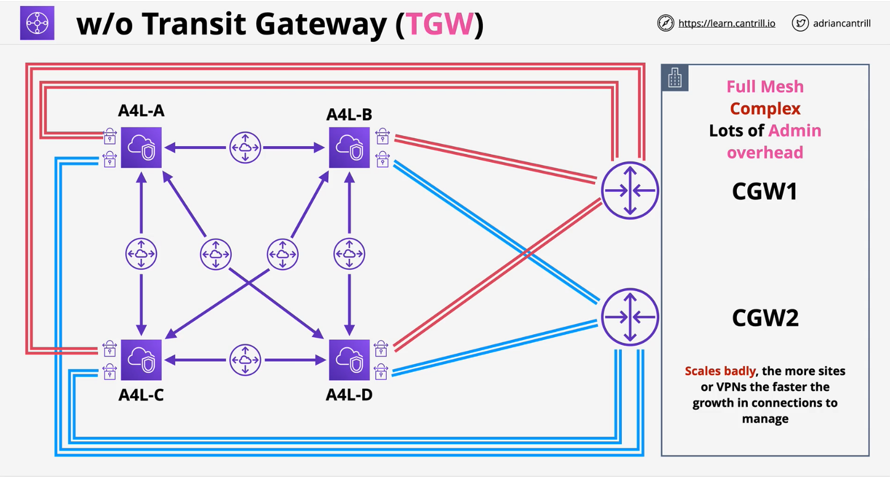
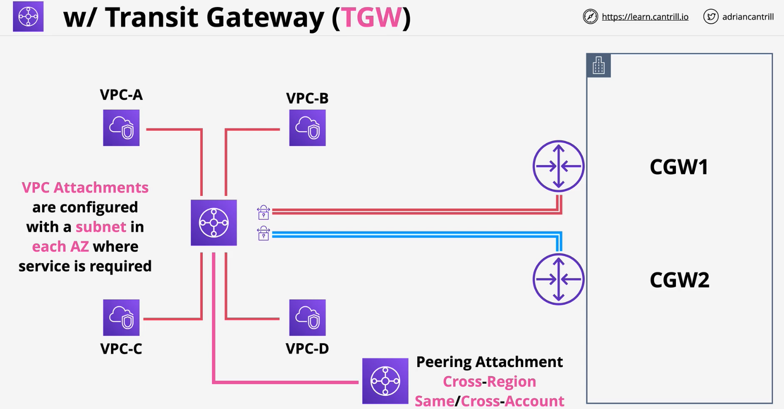
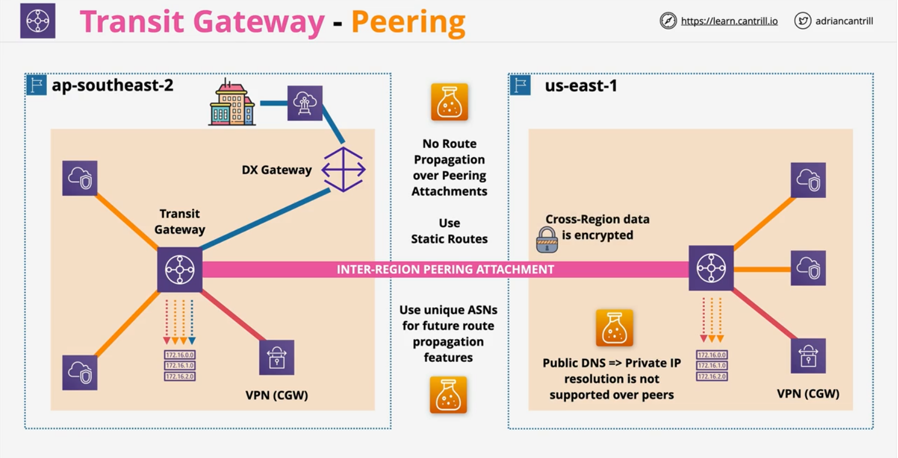
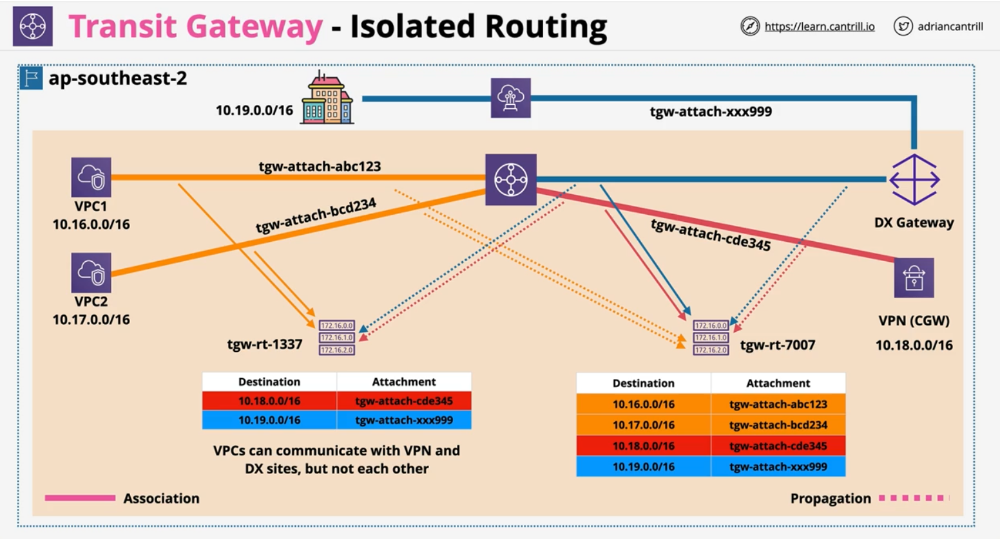

 The AWS Transit gateway is a network gateway which can be used to significantly simplify networking between VPC's, VPN and Direct Connect.

### Overview
- **Network Transit Hub** to connect VPCs to on premises networks
- Significantly **reduces** network complexity
- Single network object - **HA and Scalable**
- Connects to other network using **attachments**
    - VPC, Site-to-Site VPN & Direct Connect Gateway

### Without TGW
- VPC peering is not transitive and creates a **complex MESH** with a lot of **Admin Overhead**

### With TGW
- Supports **transitive routning** 
- Can be used to create global networks
- Share **between accounts** using **AWS RAM**
- Peer with **different regions**.. same or cross account
- **Less complexity** vs **w/o** TGW 

 

### Deep dive
- HUB and SPOKE architeture
- **1 DX Gateway** can be attached to **3 TGW**
    - Transit VIF from DX to DX gateway

- **One default route table for TGW** 
    - by default, the attachments propagate (add) routes to the default RT
    - by default, the default RT is used by all the attachments for routing decisions
    - by default, all attachments can route to all attachments 

#### TGW Peering
**TGW** can **peer** with **other TGW** - upto **50  peering atachemtns per TGW**

- Inter-region or inter-accounts peering attachment
- **no route like/propagation** over **peering attachments** - use static rotues between peers
- **RECOMMENDATION** - Use unique ASNs (TGW) for future route propagation features
- **Public DNS => Private IP** resolution is **not supporte over peers**
- **Cross-Region** data is encrypted over **AWS global network**

 

#### TGW - Isolated Routing
- Use **asscoiation** and **propogation** to accomplish isolated routing
- Attachments can only be associated with **1RT**
    - associated RT is used for routing decision for that attachement
- **RT's** can be associated with many attachments
- Attachments can propagate to many RT's
    - even those RTs which they are not associated with

