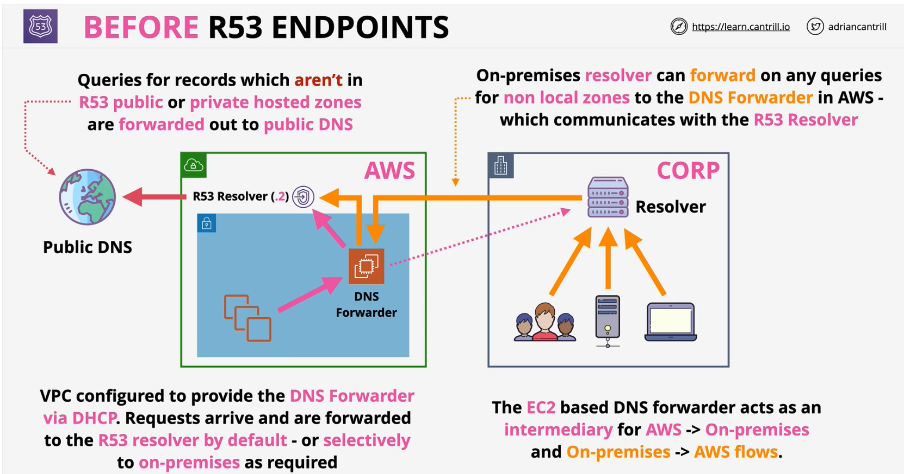
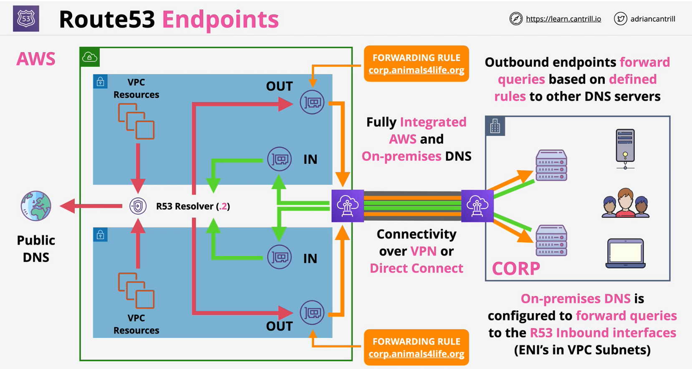
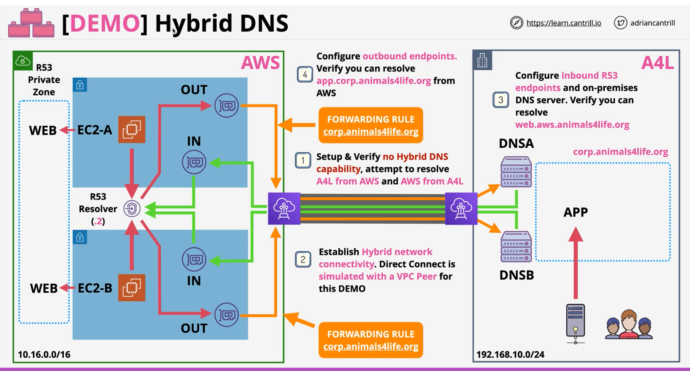

### Overview
- **DNS** via the **VPC .2**  | `+2` address
- **.2** is reserved in every subnet 
- Now called the **Route53 Resolver**   
  - VPC resources uses to access **R53 Public** and **Associated Private** Zones

- <span style="color:red;font-weight:bold">Only accessible</span> from within a VPC
  - Hybrid network integration is <span style="color:red;font-weight:bold">problematic</span> - **IN** and **OUT**


### Before Route 53 Endpoints
- Hybrid DNS integration
- DNS Forwarder via DHCP
- EC2 based DNS Forwarder in AWS to act as intermediary for AWS to On-premises and vice-versa. 




### Route53 Endpoints
- VPC interfaces (ENIs) - **Accessible over VPN or DX**
- Inbound and Outbound
    - **Inbound** = on-premises can forward to the R53 Resolver
    - **Outbound** = Conditional Forwarders, R53 to On-premises

- **Rules control** what **requests** are **forwarded**
    - your.domain.org => On-premises DNS Nameservers
  


**Inbound Enpoints** - inbound to AWS

- Update DNS configuration for on-premise DNS servers to forward queries from on-premise to AWS
    ```bash
    zone "aws.animals4life.org" {
        type forward;
        forward only;
        forwarders {10.16.105,145; 10.16.35.16; };
    };
    ```
- Update app server config to update DNS servers

**Outbound Endpoints** - outbound from AWS

- Create forward rules for domain to forward to on-prem DNS server IPs using outbound endpoint for a VPC.


