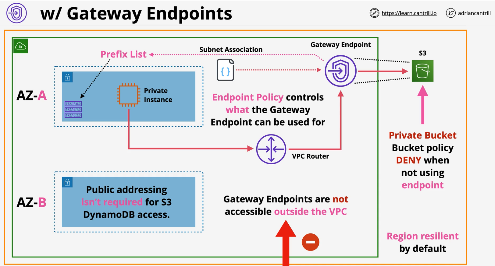
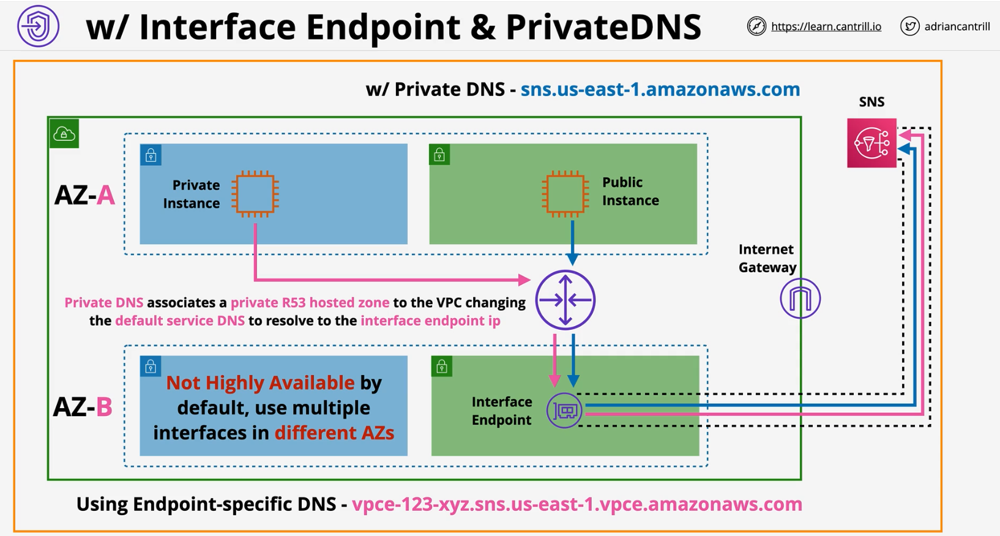
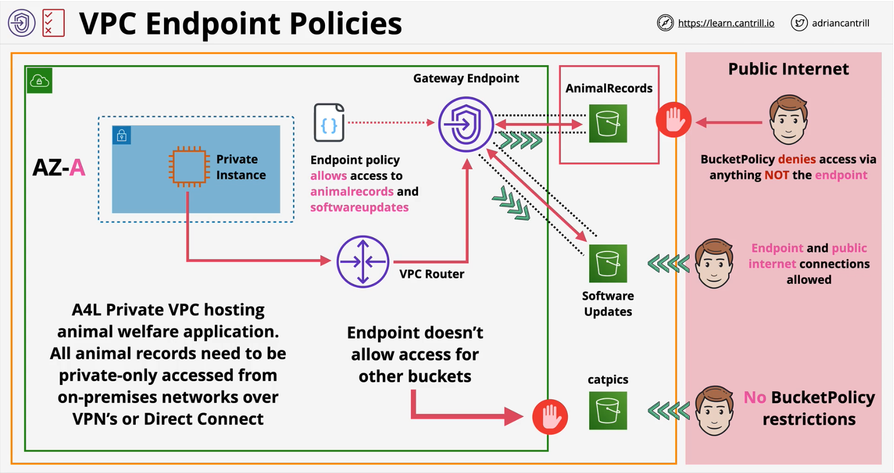
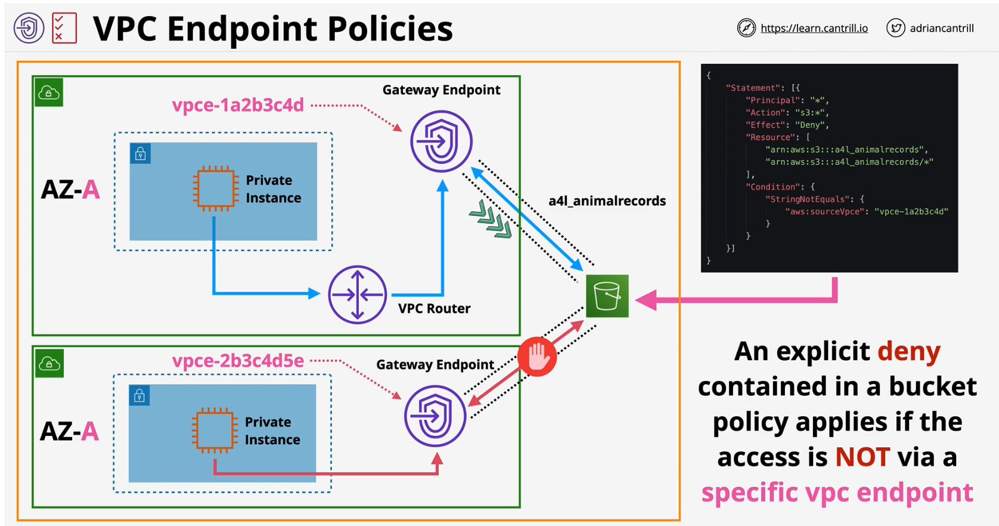

### Gateway endpoints
- Provide private access to **S3** and **DynamoDB**
- Per service per region
- **Prefix List** added to **route table** => **Gateway Endpoint**
- Highly Available (**HA**) accross all AZs in a region by default
- **Endpoint policy** is used to control what it can access
- **Regional Service** - <span style="color:red;font-weight:bold">cannot access cross-region services</span>
- **Prevent leaky Buckets** - S3 buckets can be set to private only by allowing access ONLY from a gateway endpoint
- Gateway Endpoints are **NOT** accessible **outside the VPC**



### Interface endpoints
- Provide **private access** to AWS Public Services
- Everything except **S3** and **DDB** but **S3** is supported now
- By default <span style="color:red;font-weight:bold">NOT HA</span>, added to **specific subnets** - an **ENI**
- Enable HA by adding **one endpoint** to **one subnet per AZ** used in the VPC
-  Network access controlled via **Security grroups**
-  **Endpoint policies** - restrict what can be done with the endpoint
- **TCP** and **IPv4** only 
- Uses **PrivateLink**
- Endpoint provides a NEW service endpoint DNS
  - e.g. vpce-123-xyz.sns.us-east-1.vpce.amazonaws.com
- Endpoint **Regional DNS**
- Endpoint **Zonal DNS**
- Applicatons can optionally use these. or..
- **Private DNS** <span style="color:red;font-weight:bold">overrides the default DNS for services</span> - enabled by default



### Gateway vs Interface
|Gateway|Interface|
|:---:|:---:|
|Only supports S3 and Dynamo| Support most of the AWS services except DynamoDB. (supported s3 recently)|
|By default, Highly Available| Endpoints need to be deployed to all the subnets used in AZs. (ENI)|
|| Only supports TCP and IPv4|
|Prefix list added to the route table|Private DNS overrides the default DNS for services|
|Access is controlled with endpoint policy| Additional to endpoint policy, security groups can be used to control network access|

### VPC Endpoint Policies & Bucket Policies
- By default, vpce allow access to **an entire service in a region**
    ```json
    {
      "Statement":[
        {
          "Action": "*",
          "Effect": "Allow",
          "Resorce": "*",
          "Principal": "*"
        }
      ]
    }
    ```

- Some services support endpoint policies
  - **Limits** access via **that endpoint only**
- Commonly used to **limit what private VPCs can access**
  - Endpoint policies combined with bucket policies can fine tune the access for the bucket




