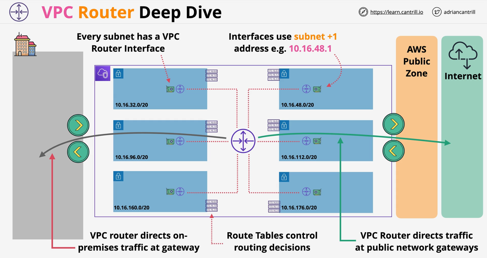
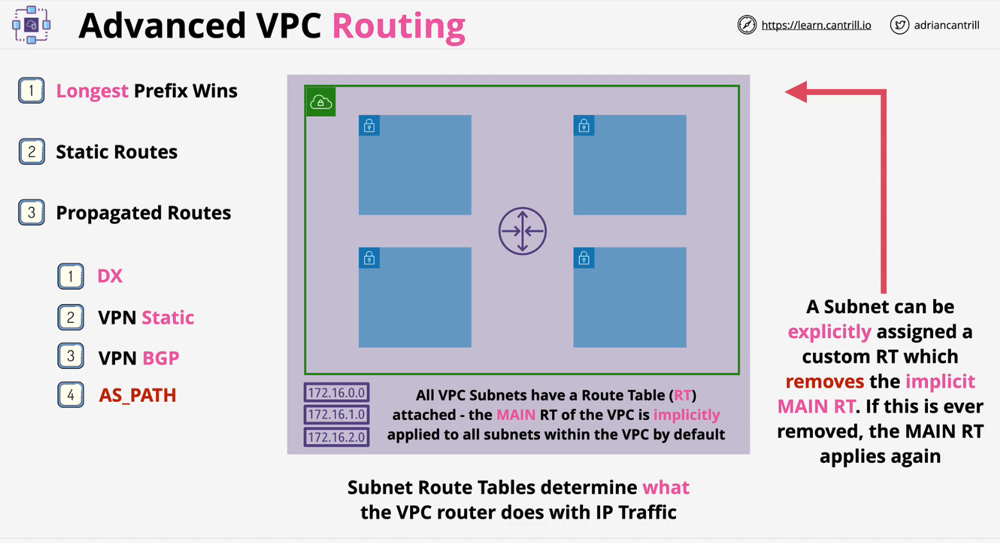

### Characteristics
- **Virtual Router** within a VPC
- **Highly Available** - across all AZs in that region
- **Scalable** - no performance management required
- **Routes** traffic **between subnets**
    - also routes **EXTERNAL** networks **INTO** the **VPC**
    - also routes **VPC** into **EXTERNAL** networks
- Router has interface in every subnet - `subnet+1` address (**default GW** via **DHCP option set**)
- Controlled using **route tables**

### Route tables 
- [Route tables for your VPC](https://docs.aws.amazon.com/vpc/latest/userguide/VPC_Route_Tables.html)
- Every **VPC** is created with a **Main route table** (RT)
    - also defaults for **every subnet** in the VPC
- **Custom route table** can be created and associated with subnets in the VPC which **removes the Main RT** from the subnet
- **Subnes** are **associated** with **One RT** (Main or Custom)
- **Main RT** should be left as it is and **Custom Route Tables** should be created for any customization
    - to ensure default association of subnet does not get default RT

- Route tables contain **routes** 
    - **most specific** routes **first**
    - **static routes** are added and update manually
    - if **route propagation** is enabled, routes are automatically added called **propagated routes**
    - :red_circle: **Limitation** :red_circle: = **50 static routes** and **100 dynamic/propagated routes**

    |Priority| Route Type/Condition|
    | :--- | :--- |
    |**1**| **Longest Prefix** |
    |**2**| Static Routes |
    |**3**| Propagated Routes <ol><li>**DX**</li><li>**VPN Static**</li><li>**VPN BGP**</li><li>**AS_PATH**</li></ol> |
     
- RT's **can be associated with gateways- IGW or VGW**
- **IPv4** and **IPv6** are handled seperatly within a RT
- Routes send traffic based on **destination** to a **target**

 