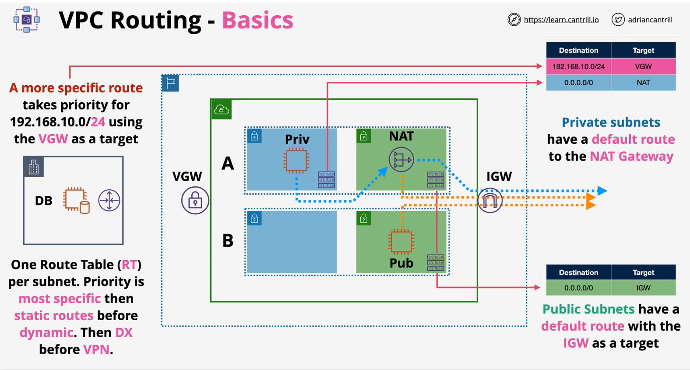
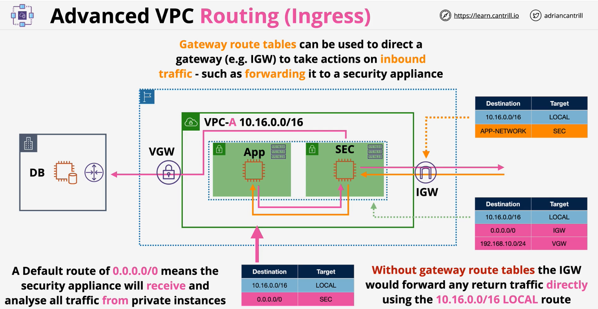

### Basics
- [Route tables for your VPC](https://docs.aws.amazon.com/vpc/latest/userguide/VPC_Route_Tables.html)

### CIDR-Overlap

- Peering between overlapping **CIDRs** isn't supported
- Create routes specific to subnets in VPCs with same CIDR
- **Single route table solution**
    - Add a more specific route for **VPC-Y** with CIDR from **VPC-Y**

- **Different route tables solution**
    - one route table for **subnet-X** in **VPC-I** routing to **VPC-X**
    - another route table to **subnet-Y** in **VPC-I** routing to **VPC-Y**
    - A solution but not a HA solution

### Ingress routing
- **Gateway route tables** can be used to direct a gateway (e.g. IGW) to take actions in inbound traffic - such as **forwarding** it to a security appliance
- fine-grain control over the routing path of traffic entering your VPC.

