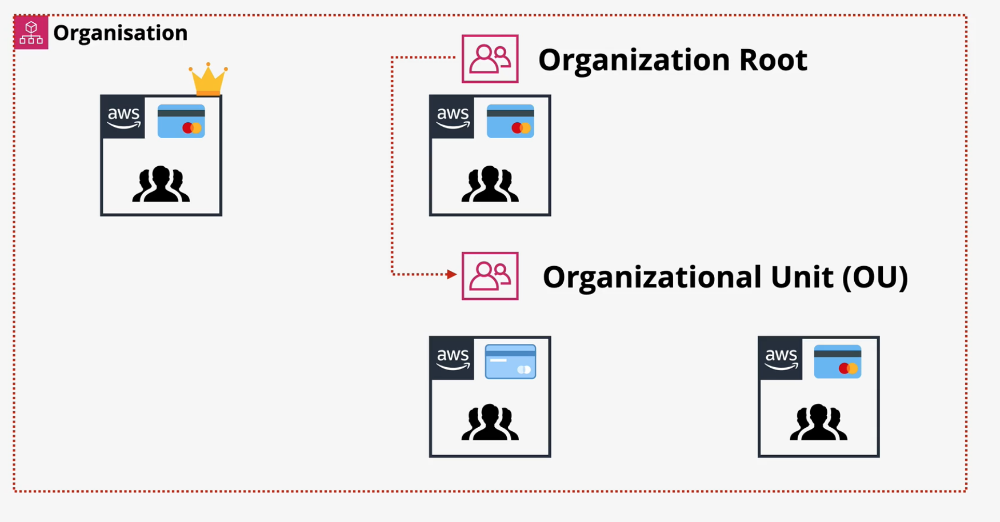

### Overview
- Centrally manage multiple AWS accounts (could be 100s for large organizations)
    - centrally manage and govern your environment as you grow and scale your AWS resources
- AWS Organizations is integrated with other AWS services
    - can define **central configurations**, **security mechanisms**, **audit requirements**, and **resource sharing** across accounts in your organization
- **One and only Management** account and **0 or more Member** accounts 

### Organization root and units
- **Organization Root** is just a container which can contain **both management and member accounts**
- **Organization Root** also can contain other containers called **Organizational Unit (OU)**
- OU can also contains both management and member accounts as well as  additional OUs
- Organization root and OU makes a heirarichal set up of accounts 

### Benfits
#### Centrally manage billing and costs - Consolidated Billing
- **Management Account** becomes payer account since all the bills are passed to the management account form members account
- Single bill for management account and all members account
- Reduces significant overhead for managing bills for larger enterprise
- Consolidation of **reservation and volume discounts**

#### Control access and permissions
- Apply service control policies (SCPs) to users, accounts, or OUs to control access to AWS resources, services, and Regions within your organization

### Steps to create AWS organization for existing accounts
:green_book: creating new account within the organization does not require invitation

- Create organization using existing account
    - the account now become **Management Account** (previously **Master account**)
- From the **Management Account** invite other existing **standard** accounts
    - existing **standard** accounts will need to approve the invite to join the organization
    - once approved standard accounts become **member** accounts of the organization

### Role to switch bewtween acounts
- General account to switch to many other different accoutns
- Role with trust from accountID (General account)
- Role with adminstrative policy