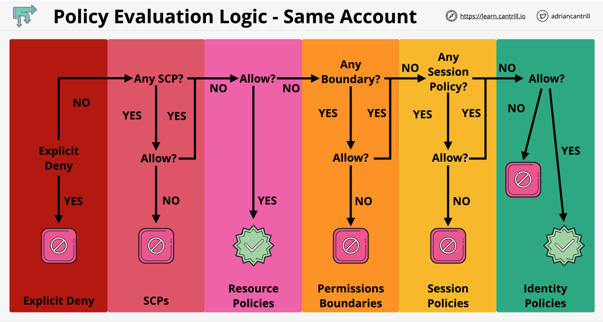
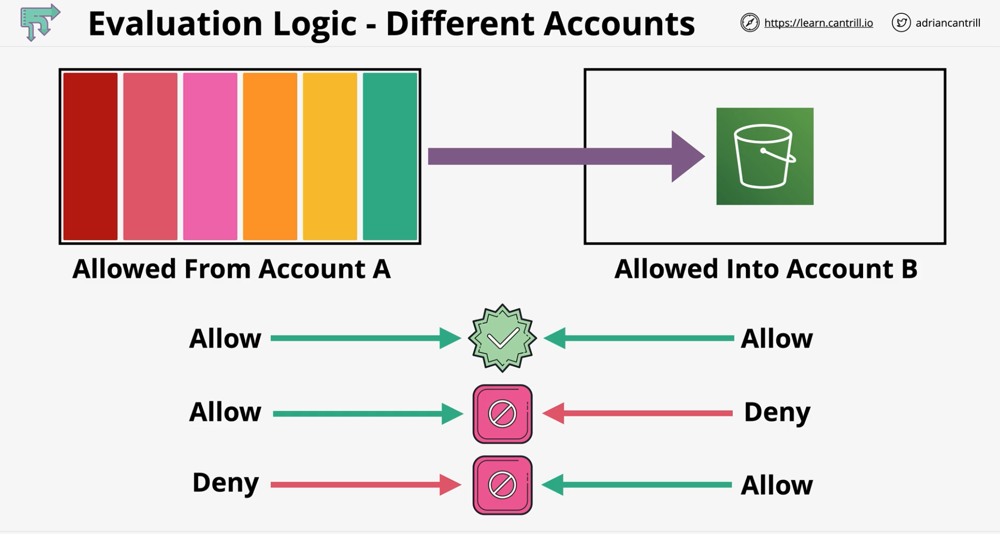

### Overview
|  | |
|:---:|:---: |
|**Explicit Deny**|Check for Explicit Deny **Procced with SCP if there is no explicit deny**|
|**SCP**|Check for any SCP policy and check for Allow **Procced if SCP allows**|
|**Resource Policies**|Check for Allow and execute if it is allowed **Procced if Allow is not there**|
|**Permission boundaries**|Check for disallowed action form boundary policy **Procced with Session policy if no permission boundary**|
|**Session Policies**|Check for Session Policy **Procced with Identity Policy if allow**|
|**Identity Policies**| Check for Allow or no Allow **Procced with resource execution**|

### Same Account

### Different Accounts

