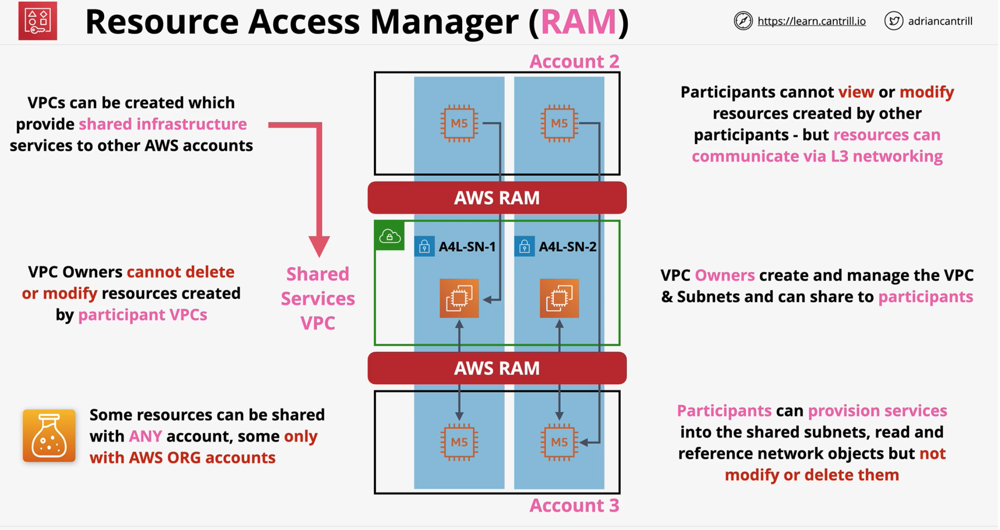
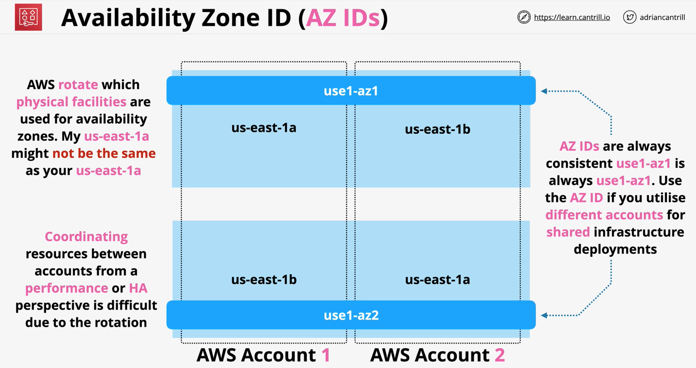

Resource Access Manager (RAM) allows AWS resources to be shared securely between AWS Accounts.

### Overview 
- Allows AWS resources to be shared securely between AWS Accounts.
- Supported resource types
    - [AWS VPC, AWS App Mesh, Amazon Auror, AWS Route 53 and more](https://docs.aws.amazon.com/ram/latest/userguide/shareable.html)
    - Shared resources are accessed natively (ConsoleUI and API)
    - **E.x.** Shared subets is visible in both accounts
- Shared with **Principals**
    - with all of the other accounts in the **organization**
    - with only those contained by one or more specified **organizational units (OUs)**
    - with specific **AWS accounts** by **account ID**
- **NO CHARGE** for RAM - cost is only associated with the AWS shared resource
- Provides **substantial changes** to traditional AWS architectures
    - can be used to support certain common architectures such as a Shared Services VPC
    - TGW and VPC peering is being used traditionally

### Sharing the resource
- Owner account **creates a share**, provides a name
- Owner **retains full ownership** - full read/write
    - Other account will have subset of the permisssion
- Defines the **principal** with **whom to share**
    - if the principal is within an AWS org with sharing enabled, it is **accepted automatically**
    - if the principal is **non ORG account** or **sharing is not enabled in AWS ORG**, the principal will have to **accept an invite** 

### Shared Services VPC
- Shared resource like subnet is owned and can only be modified by owner account of shared resource
- Resource like EC2 launched in shared subnet is owned by account owner NOT the shared resoruce owner

:warning: Depending on the type of shared resource, it might not be sharable with any AWS accounts rather only could be shared with accounts within an AWS ORG
 

### Availability Zone ID (AZ IDs)
Same AZ name for 2 different AWS accounts can be mapped to 2 different physical locations by AWS.
**AZ IDs** are consistent accross all AWS accounts and can be used for **shared infranstructure deployment**. 

 

