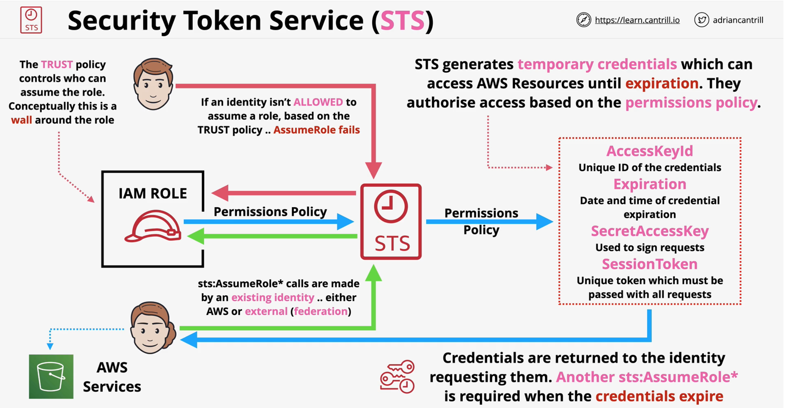
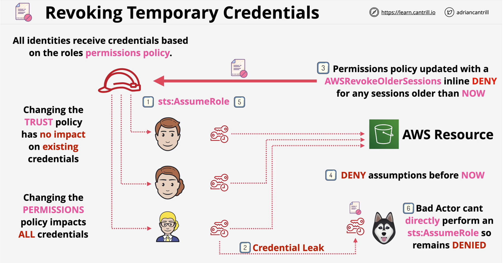

### STS
- Generates temporary credentials (**sts:AssumeRole\***)
- Credentials are short lived unlike **AccessKeyId** and **SeretAccessKey** for a user
- Credentials are **used to access AWS resources**
    - more limited policy can be provided with IAM policy
- Requested by an Identity (AWS or EXTERNAL)
    - identity could be **AWS services**, **AWS user/role** or **external web identity** 

### STS Credentials
- **Trust policy** is attached to the IAM role
    - specifies which identity can assume the role
    - May be MFA ????

- **Permission policy** also attached to the IAM role
    - specifies the permission of role for AWS resources

- STS generates **temporay credentials** which can access AWS Resource until <span style="color:red;font-weight:bold">until expiration</span>. It authorise access based on the **permission policy**

- If the permission of the role changes, the permission for the creds will also change.
- STS has ability to revoke active sessions and credentials for a role
    - adding a policy with using a time stamp
    - AWSRevokeOlderSessions

</br>



### Revoking temporary credentials
- Many identities can assume the same role
    - all the identities get same permission defined in the permission policy

- Temproray credentials <span style="color:red;font-weight:bold">cannot be cancelled</span>
    - temporary creds comes with expiration date

#### How to remediate credential leak??
:red_circle: **Limitations** </br>

- Updating the trust policy has not impact on existing credentials
- Changing the permissions policy impacts ALL credentials

:white_check_mark: **Using AWSRevokeOlderSessions** </br>

- Permission policy update with **AWSRevokeOlderSessions** inline DENY for any sessions older than **NOW**
- **DENY** all the credentials generated before **NOW**
- Identities can reassume the role after enforcing **AWSRevokeOlderSessions**

!!! example
```json
{
    "Version": "2012-10-17",
    "Statement": [
        {
            "Effect": "Deny",
            "Action": [
                "*"
            ],
            "Resource": [
                "*"
            ],
            "Condition": {
                "DateLessThan" :{
                    "aws:TokeIssueTime": "2021-05-21T02:24:21.3702"
                }
            }
        }
    ]
}
```
</br>

<span style="color:orange;font-weight:bold">metadata url: http://169.254.169.254/latest/metadata/iam</span>

