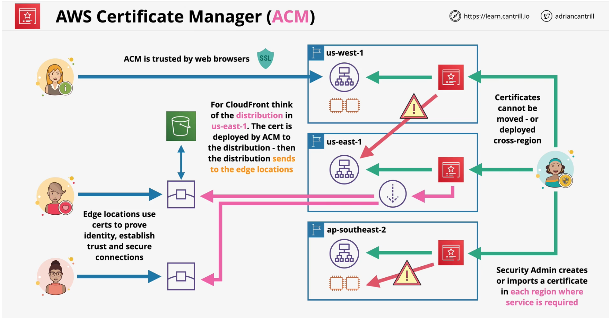

## AWS Certificate Manager (ACM)
- HTTP - simple and insecure
- HTTP**S** - **SSL/TLS** Layer of encryption added to HTTP
- Data is encrypted **in-transit**
- Certificates **prove identity**
- **Chain of trust** - Signed by a **trusted authority**
- ACM lets you run a **public** or **private** Certificate Authority (CA)
- **Private CA** - Applications need to **trust your private CA**
- **Public CA** - Browsers trust a list of provider, which can trust other providers.

- ACM can **generate** or **import** certificates
    - if generated, it can **automatically renew**
    - if imported, *you are responsible for importing it*
- Certificates can be deployed only to **supported services**
    - Cloudfront, ALB ... *NOT EC2*
- ACM is a **regional service**
- Certs cannnot leave the region once they are generated or imported in
- Eg. *To use a cert with **ALB** in **ap-southeast-2** you need a cert in **ACM** in **ap-southeast-2***
- Global Services such as **CloudFront** `operates as though within 'us-east-1'`

