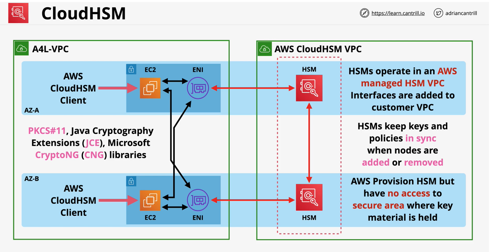

## CloudHSM
-  **HSM** - hardware security module to manage cryprtographic operations
-  **AWS** provisioned it but full managed by customer
- [Federal Information Processing Standard Publication 140-2, (FIPS PUB 140-2)](https://en.wikipedia.org/wiki/FIPS_140-2)
- Fully **FIPS 140-2 Level 3** (*KMS is L2 overall, some L3*)
- KMS can use **CloudHSM** as a **custom key store**, CloudHSM integration with KMS (newer feature)

|CloudHSM| KMS|
|---|---|
| FIPS 140-2 level3 | FIPS 140-2 level 2 (some L3) |
| Industry Standard API - **PKCS#11**,Java Cryptography Extenstion (**JCE**), Microsoft **CryptoNG** (CNG) libraries | Communicated via AWS API|

- Configure HSM in cluster mode to ensure HA mode (multi AZ). By default, it does not run on HA mode.

### Use Cases
- No native AWS integration .. e.g. no s3 SSE
    - client side encryption can be used before uploading
- Offload the SSL/TLS Processing of Web Servers.
- Enable Transparent Data Encryption (TDE) for Oracle Databases
- Protect the Private Keys for an Issuing Certificate Authority (CA)