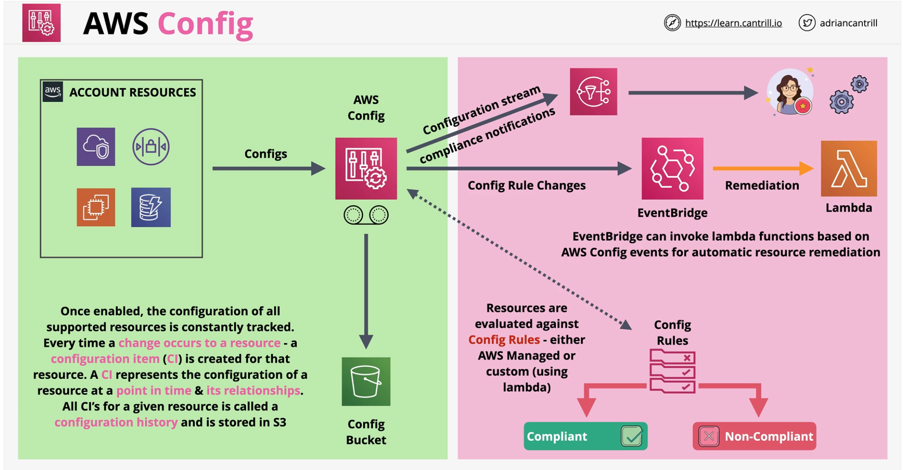

### AWS Config
AWS Config is a service which records the configuration of resources over time (configuration items) into configuration histories.

- Record configuration changes over time on resources
- **Auditing** of changes, **compliance** with standards
- Deos not prevent changes from happening.. no protection
-**Regional Service** .. supoorts **cross region** and **account** aggregation
- Changes can generate **SNS Notifications** and near-realtime events via **EventBridge** and **Lambda**
- All the config is **stored regionally in s3** bucket which can be interacted with aws config api

