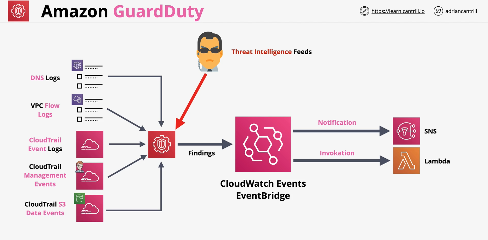

## Amazon GuardDuty
Guard Duty is an automatic threat detection service which reviews data from supported services and attempts to identify any events outside of the 'norm' for a given AWS account or Accounts.

- **Continous** security monitoring service - once enabled
- Analyses **supported Data Sources**
    - uses **AL/ML** and **threat intelligence feeds**
- Identifies **unexpected** and **unauthorized** activity
    - either **notify** or **event-driven** protection/remediation
- Support multiple accounts (**MASTER** and **MEMBER**)

> **AL/ML - Artificial Intelligence/ Machine Learning**

 

