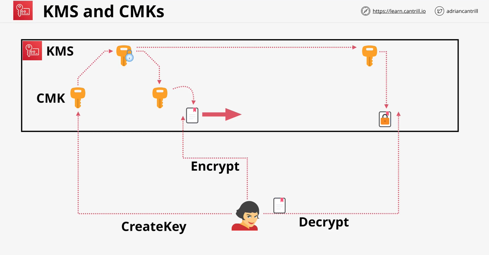

## AWS KMS
### Key Management Service

- Regional and Public Service
- Create, Store and Manage Keys
- Supports both **symmetric** and **asymmetric** keys
- Also supports cryptographic operations - **encrypt**, **decrypt** & ...
- Keys never leave KMS - Provides FIPS 140-2 (L2)
    - [FIPS 140-2 & FIPS 140 -3](https://www.wolfssl.com/license/fips/?gclid=Cj0KCQiAy4eNBhCaARIsAFDVtI1vepnZV6uZeUTV_-hRzCsVR897tDzuY-KcbLrZdM8XabG4n6GMaEsaAo_qEALw_wcB)

### Customer Master Keys (CMK)

- **CMK** - **C**ustomer **M**aster **K**ey
- CMK is **logical** - ID, date, policy, desc and date
    - backed by **physical** key material
    - key material can be **generated** or **imported**
- CMK can be used (**encrypt/decrypt**) for up to **4KB of data** 
- CMK is encrypted by **AWS** before storing in the disk.

### Data Encryption Keys (DEKs)
- Workaround for `4KB data` limitation
- GenerateDataKey - works on > **4KB**
    - linked to specific CMK
    - KMS does not store DEK in any way
    - generates and discard it once user uses it
- **DEK** is provided in 2 versions
    - **Plaintext** version
    - **Ciphertext** version
- **Encrypt** data using **plaintext** key
    - then **discard** the **plaintext** key
- **Store encrypted key** with encrypted ddata 

> **S3** create `DEK` for every object

### Key Concepts
- CMKs are isolated to a **region** and never leave
- **AWS** Managed or **Customer** Managed CMKs
    - [Customer keys and AWS keys](https://docs.aws.amazon.com/kms/latest/developerguide/concepts.html#key-mgmt)
    - Customer Managed Keys are more configurable
- Both types of keys support rotation
 
| Type of KMS key | Can view KMS key metadata | Can manage KMS key | Used only for my AWS account | [Automatic rotation](rotate-keys.md) | 
| --- | --- | --- | --- | --- | 
| [Customer managed key](#customer-cmk) | Yes | Yes | Yes | Optional\. Every 365 days \(1 year\)\. | 
| [AWS managed key](#aws-managed-cmk) | Yes | No | Yes | Required\. Every 1095 days \(3 years\)\. | 
| [AWS owned key](#aws-owned-cmk) | No | No | No | Varies |

- CMK itself contains **Backing Key** as well as **previous** backing keys
- Aliases for CMKs - **Per Region**

### Key Policies and Securities
- Key Policies (Resource)
- Every CMK has a key policy
    - Customer manage CMK policy can be adjusted 
    - CMK key policy explicity told to trust AWS account
    - IAM policies to ensure IAM role/user have access to KMS operation on the key