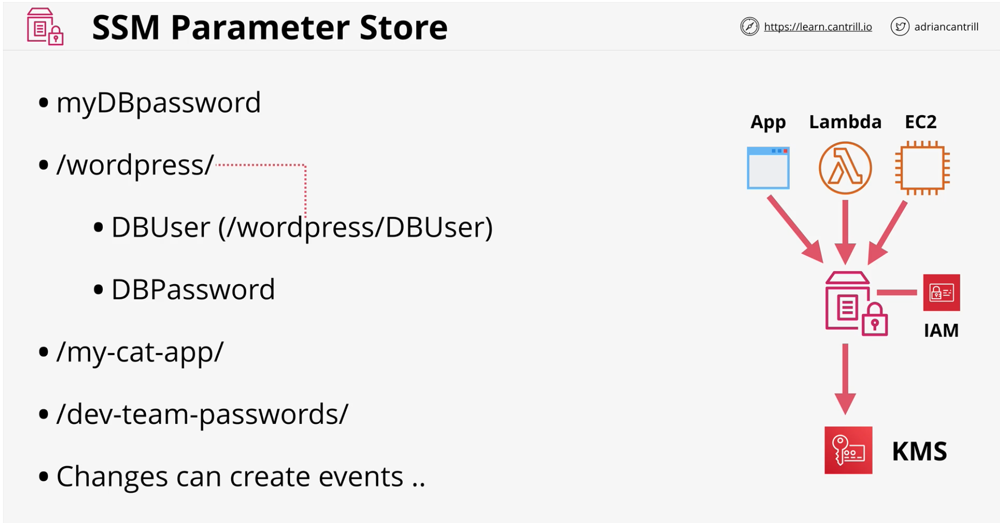

## AWS Systems Manager Parameter Store
- Storage for configuration and stores
- Different types of parameters to be stored
    - String
    - StringList
    - SecureString
- Ex: Licencse codes, Database Strings, Full Configs & Passwords
- **Hierrarchies & Versioning**
    - Allows to store parameters using **Hierrarchial** Order
    - Allows to store different **versions** the parameter
- Can strore both **Plaintext** and **Ciphertext**
    - KMS in turn can use **Ciphertext** 

- **Public Parameters** are available. **E.x.** -  Latest AMI per region

