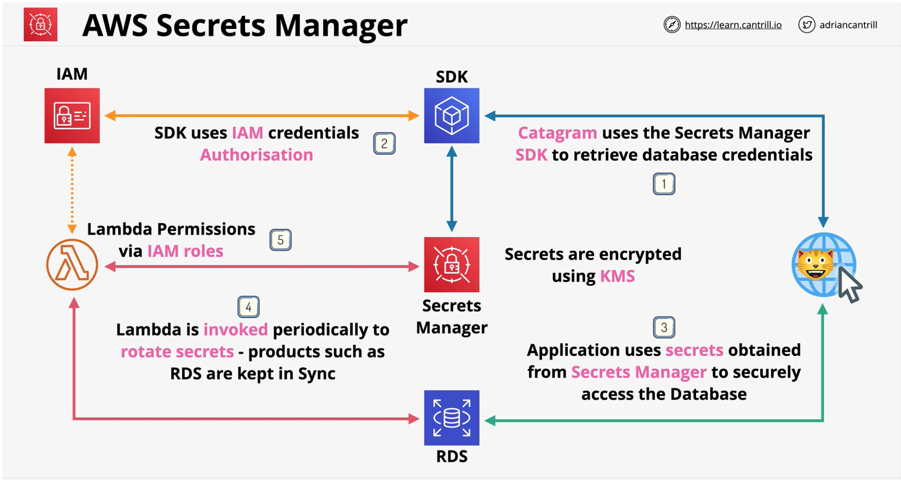

## AWS Secrets Manager
- Shares **functionality** with Parameter Store
- Designed for **secrets** .. (passwords, API Keys)
- Usable via **Console, CLI, API or SDK's** (integration)
- Supports **automatic rotation** .. this uses **Lambda**
- Directly **integrates** with some AWS produts like **RDS**
    - sync the authectication creds as well
- Permissions controlled by IAM
- Secrets are encrypted using **KMS**

