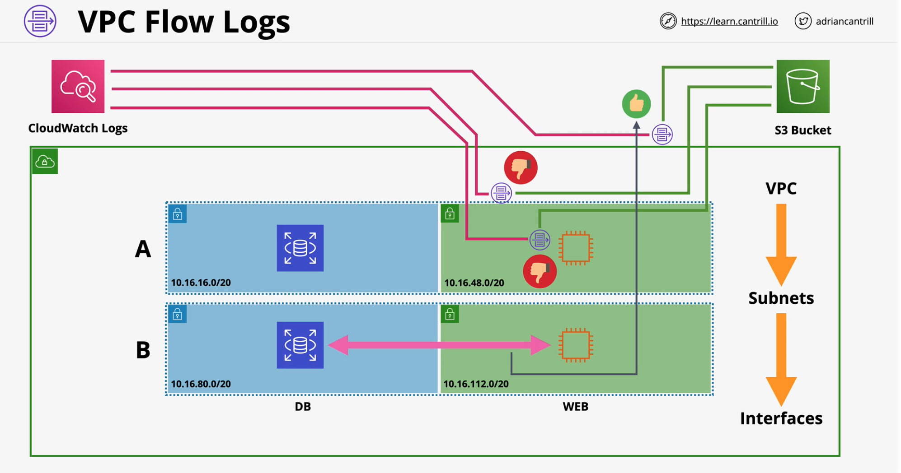
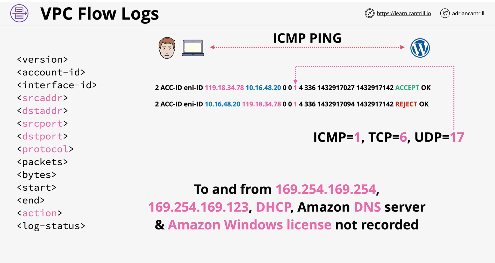

### VPC Flow Logs
- Capture **packet Metadata** .. **NOT  packet contents**
- Different monitoring points to apply... 
    - **VPC** - all interfaces in the VPC
    - **Subnet** - all interfaces in that subnet
    - **Interface directly**
- VPC Flow Logs are **NOT realtime**
- Destination can be **S3** or **Cloudwatch Logs**

