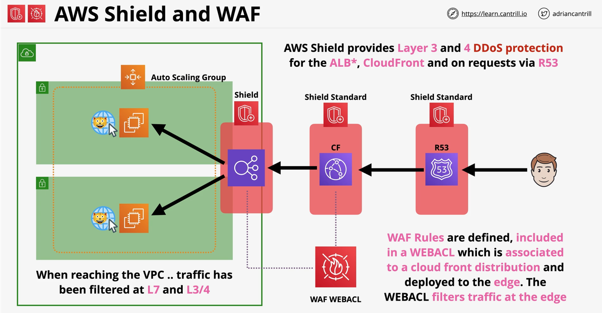

### AWS Shield
- Provides AWS resources with **DDoS protection**

|AWS Shield Standard| AWS Shield Advance|
| :---: | :---: |
|Free with **Route53** and **CloudFront** | **$3000/month/organization** which also supports - **EC2, ELB, Global Accelerator** in addition to **Cloudfront & R53**|
|Protect against **Layer 3** and **Layer 4** **DDoS** attacks| Protect against **Layer 3** and **Layer 4** **DDoS** attacks |
|| Provides **24/7 (365 days)** **advance response team** to deal with DDoS atack|
|| **Financial Insurance** for any increased AWS cost incurred by the attack |

### AWS WAF
**Web Application Firewall**

- **Layer 7** (HTTP/s) Firewall
- Protect against complex Layer 7 attacks/exploits
- **SQL Injections, Cross-Site Scripting**, Geo Blocks, Rate Awareness
- Web Access Control List (**WEBACL**) integrated with **ALB, API Gateway and CloudFront**
    - **WAF** provides **WEBACL** 
    - **Rules** are added to **WEBACL** and **evaluated** when traffic **arrives**

- **WAF** Rules
    - WEBACL => RULE GROUPS* => RULES
    - WEBACL Capacity Units (WCU)
        - Simpler rule uses fewer WCU
        - More complex rule uses more WCU
        - Limit on how many WCU on WEBACL
    - Charged for following..
        - WEBACL - monthly fee for each ACL
        - Rules - monthly fee for each rule
        - Based on no. of Requests 
    - WEBACL has default action
        - **ALLOW** or **BLOCK**
        - **COUNT** - how many times a rule is matched
    - Come with 2 different types of rules
        - Regular Rule
        - Rate-Based Rule - frequency at which an IP could go through ACL
     - Conditions (**Layer 7 attributes**) for rule can be based on 
        - IP Addresses
        - Country or GEO
        - Length of the request
        - SQL code in the request
        - Strings in the request
        - Scripts and headers in the request

### AWS Shield and WAF in action

### Exam Points
|AWS Shield | AWS WAF|
| :---: | :---: |
|DDoS|Layer 7 (HTTP/HTTPS) |
|| Rate Limiter and Layer 7 aspects|