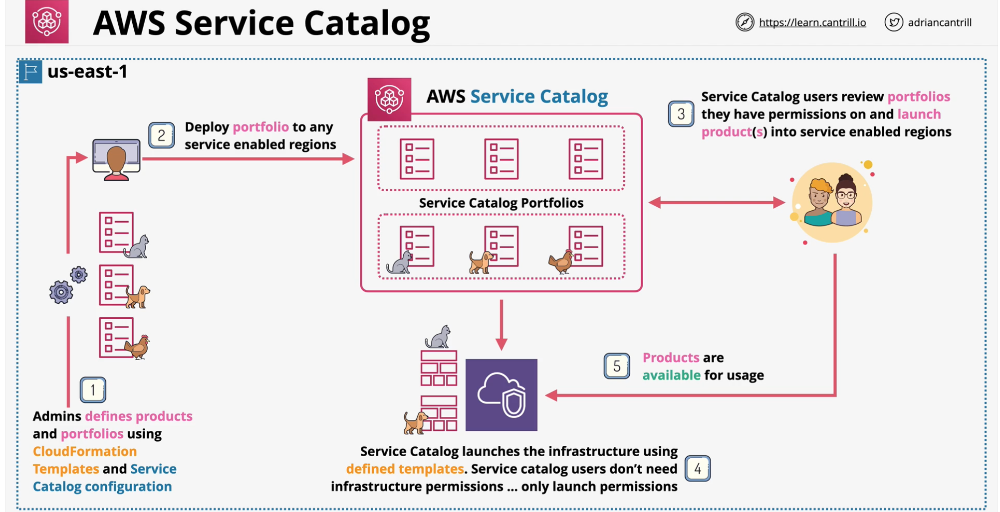

#### what is service catalog?
- **Document** or **Database** created by an IT Team
- Organised collection of proucts
- Offered by the IT team
- **Key Product Information** - Product Owner, Cost, Requirements, Support Information, Dependencies
- Defines approval of provisioning from IT and Customer Side
- Managed costs and scale service delivery

#### AWS service catalog
- **regional** service
- allow end users to deploy infrastructue without having actual infrastructure permission
- **Self-service** Portal for `end users` 
    - launch **predefined** (by admin) products
- end users permission can be controlled
- Admins can define those products and the permissions required to launch them
- Build **products** into **portfolios**

