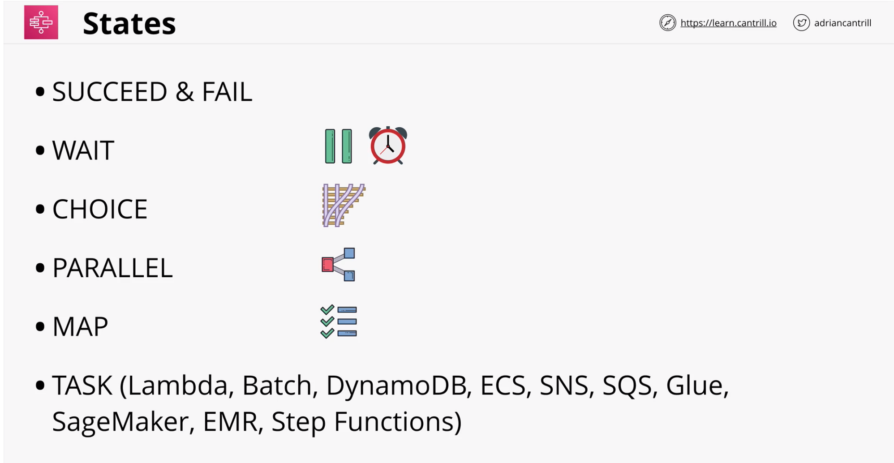

AWS Step Functions - Long running serverless workflows

#### Limitations of lambda
- lambda -> FAAS
- 15 min - max execution time 
- functions can be chained together. (scaling is tedious and difficult to maintain)
- runtime environments are stateless

#### State Machines
- Serverless workflow ... START -> STATES -> END
- States are THINGS which occur
- Maximum duration - 1 year
- Standard Workflow & Express Workflow
- Started via API gateway, IOT rules, EventBridge, Lambda ...
- Amazon State Language (ASL) - JSON Template
- IAM Role is used for permissios

