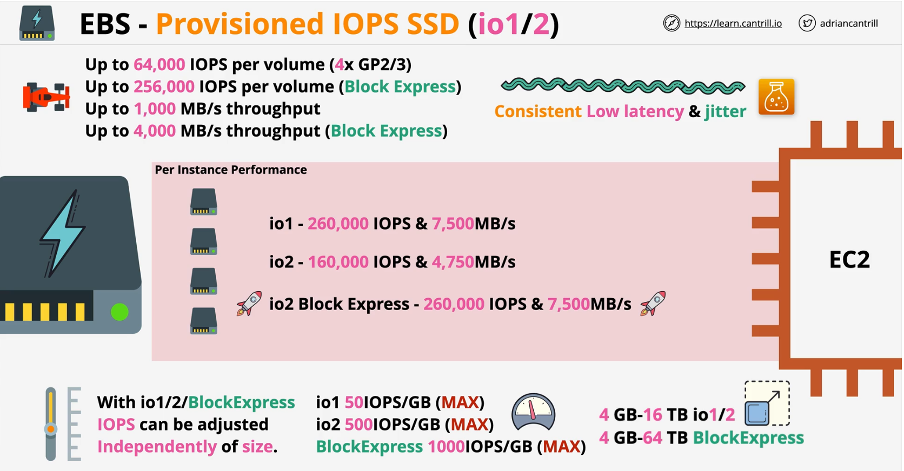
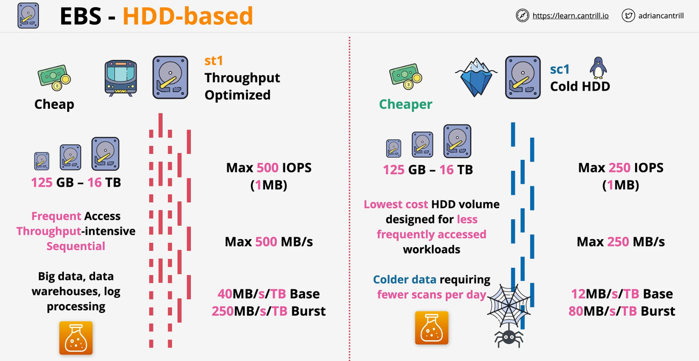

### General Purpose - SSD

- 1 IOPS => 1 IO (16KB) in 1 second
- Initial capacity - 5.4 million IO Credits => 3000 IOPs
    - great for **boots** and **initial workloads**

> gp3 is cheaper than gp2 for base performance

||gp2|gp3|
|:--:|:---|:---|
|Volume| 1GB-16TB|1GB-16TB|
|IOPs credit|  <ul><li>Baseline performance (100 IO credits/s) + 3 IO Credits/s per GB</li><li>Volumes > 1000GB does not use credit system</li></ul>| no credit bucket system<ul><li>Baseline performance - 3000 IOPS + 125 MiB/s</li><li>Extra cost upto 16,000 and 1000 MiB/s</li></ul>|
|Max IOPS per volume (16KiB I/O)|16,000	|16,000	|
|Max throughput per volume	| 250 MiB/s *|1,000 MiB/s|
|Boot volume | Supported | Supported |	
|Use Cases|<ul><li>Low-latency interactive apps</li><li>Development and test environments</li></ul>| + <ul><li>virutal machine</li><li>single instance DB</li></ul>|
|Amazon EBS Multi-attach| Not supported | Not supported|

### Provisioned IOPS SSD (io1/2)
- IOPS can be adjusted independently of size
- Consistent Low Latency & jitter

||block express| io1/io2|
|:---|:---|:---|
|Volume| 4GB- 64TB|4GB-16TB|
|Max IOPS per volume (16KiB I/O)|256,000	|64,000	|
|Amazon EBS Multi-attach| Supported | Supported|
|Max throughput per volume	| 4000 MiB/s *|1,000 MiB/s|
|Use Cases| Workloads that require:<ui><li>Sub-millisecond latency</li><li>Sustained IOPS performance</li><li>More than 64,000 IOPS or 1,000 MiB/s of throughput</li></ul>|<ul><li>Workloads that require sustained IOPS performance or more than 16,000 IOPS</li><li>I/O-intensive database workloads</li></ul>|

### Hard Disk Drive (HDD)
- **st2** (throughput optimized) and **sc2** (cold HDD)

### Instance Store
An instance store provides **temporary block-level storage** for your instance. This storage is located on disks that are **physically attached to the host** computer. Instance store is ideal for temporary storage of information that changes frequently, such as **buffers, caches, scratch data**, and other temporary content, or for data that is replicated across a fleet of instances, such as a load-balanced pool of web servers.

- **Block Storage** Devices
- Physically connected to **one EC2 Host**
- Instances **on that host** can access them
- **Highest storage performance** in AWS
    - already **included with the instance price**
- CAN ONLY BE ATTACHED AT LAUNCH TIME
- Instances moving between hosts will lose the access to the ephemeral volumes
    - if hardware hosting the ephemeral volume is lost, the data in the volume is also lost

- **NOT all the instances** support instance store volumes, larger the size of the instance, larger no. of instance volumes can be allocated

### EBS vs Instance Store
|EBS|Instance Store|
|:---:|:---:|
|Persistence||
|Reslience||
|Storage isolated from instance lifecycle||
|Resilence w/App In-built Replication...|... it depends|
|High performance needs...|... it depends|
||Super high performance needs|
||Cost already included within instance price|

- **Cheap** = ST1 or SC1
- **Throughput..streaming** - ST1
- **Boot** - not ST1 or SC1
- **GP2/3** - up to **16,000 IOPS**
- **io1/2** - up to **64,000 IOPS**  (*256,000)
- **RAID0 + EBS** up to **260,000 IOPS (io1/2-BE/GP2GP3)** 
    - [raid-config-options](https://docs.aws.amazon.com/AWSEC2/latest/UserGuide/raid-config.html#raid-config-options)
    - limited by instance size + EBS
- More than 260,000 IOPS - INSTANCE STORE
  