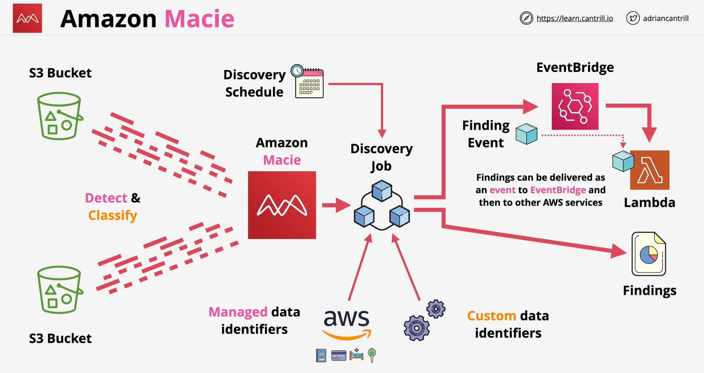

### Overview

- Data **Security** and Data **Privacy** Service
- Discover, Monitor and Protect Data .. stored in S3 buckets
- **Automated** discovery of data 
    - **PII** - Personal Identifiable Information
    - **PHI** - Personal Health Information
    - **Finance**
- **Managed** data identifiers - **Built-in** - ML/Patterns
    - maintained by **AWS**
    - credentials, finanace, health, personal identifiers
- **Custom** data identifiers - **Proprietray** - Regex Based
    - created by **customer**
    - **Regex** - defines a `pattern` to mach in data e.g. `[A-Z]-\d{8}`
    - **Keywords** - optional sequences that need to be in proximity to regex match
    - **Maximum Match Distance** - how close keywords are to regex pattern
    - **Ignore words** - if regex match contains ingore words, it's ignored
- Both **identifiers** generates `findings` which 
    - can be dealt with `interactively`
    - integrates with `Security Hub`
    - `finding events` to EventBridge
- **Centrally Managed account** - either via **AWS ORG** or one Macie Account **Inviting**

- **Discovery jobs** with **data identifiers** (managed and/or customer) runs on s3 buckets and **generates findings**

- **Policy Findings** - related to policy update
    - Policy:IAMUser/**S3BlockPublicAccessDisabled**
    - Policy:IAMUser/**S3BucketEncryptionDisabled**
    - Policy:IAMUser/**S3BucketPublic**
    - Policy:IAMUser/**S3BucketSharedExternally**

- **Sensitive data findings** - any sensitive data in buckets
    - SensitiveData:**S3Object/Credentials**
    - SensitiveData:**S3Object/CustomIdentifier**
    - SensitiveData:**S3Object/Financial**
    - SensitiveData:**S3Object/Multiple**
    - SensitiveData:**S3Object/Personal**
  
 

