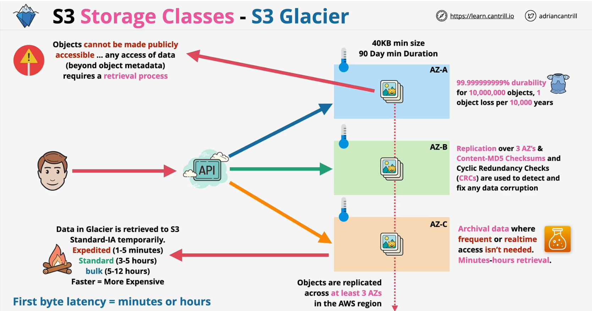

### Storage Object Classes
- By default, objects are replicated across **at least 3 AZs**
- **200 OK** for successful response
- **TRANSFER IN** is free but **$ per GB is charged for TRANSFER OUT** + **a price  per 1000 requests**

#### Comparing the Amazon S3 storage classes
| Storage class | Designed for | Durability \(designed for\) | Availability \(designed for\) | Availability Zones | Min storage duration | Min billable object size | Other considerations  | 
| --- | --- | --- | --- | --- | --- | --- | --- | 
|  S3 Standard  |  Frequently accessed data \(more than once a month\) with millsecond access  |  99\.999999999%   |  99\.99%  |  >= 3  |  None  |  None  |  None  | 
|  S3 Standard\-IA  |  Long\-lived, infrequently accessed data \(once a month\) with millisecond access  |  99\.999999999%   |  99\.9%  |  >= 3  |  30 days  |  128 KB  |  Per GB retrieval fees apply\.   | 
|  S3 Intelligent\-Tiering  |  Data with unknown, changing, or unpredictable access patterns  |  99\.999999999%  |  99\.9%  |  >= 3  |  None  |  None  |  Monitoring and automation fees per object apply\. No retrieval fees\.  | 
|  S3 One Zone\-IA  |  Recreatable, infrequently accessed data \(once a month\) with millisecond access  |  99\.999999999%   |  99\.5%  |  1  |  30 days  |  128 KB  |  Per GB retrieval fees apply\. Not resilient to the loss of the Availability Zone\.  | 
|  S3 Glacier Instant Retrieval  | Long\-lived, archive data accessed once a quarter with millisecond access | 99\.999999999%  |  99\.9%  |  >= 3  |  90 days  |  128 KB  | Per GB retrieval fees apply\. | 
|  S3 Glacier Flexible Retrieval  | Long\-lived archive data accessed once a year with retrieval times of minutes to hours | 99\.999999999%  |  99\.99% \(after you restore objects\)  |  >= 3  |  90 days  |  40 KB  | Per GB retrieval fees apply\. You must first restore archived objects before you can access them\. For information, see [Restoring an archived object](restoring-objects.md)\. | 
|  S3 Glacier Deep Archive  | Long\-lived archive data accessed less than once a year with retrieval times of hours | 99\.999999999%  |  99\.99% \(after you restore objects\)  |  >= 3  |  180 days  |  40 KB  | Per GB retrieval fees apply\. You must first restore archived objects before you can access them\. For information, see [Restoring an archived object](restoring-objects.md)\. | 
|  RRS \(not recommended\)  |  Noncritical, frequently accessed data with millisecond access  |  99\.99%   |  99\.99%  |  >= 3  |  None  |  None  |  None  | 

### S3 Standard, Standard IA, S3 One Zone-IA

### S3 Glacier
- Objects cannot be made publicly accessible
    - any access of data (beyond object metadata) requires a retrieval process

### S3 Intelligent-Tiering

### S3 Lifecycle Configuration
- Set of rules on  a bucket or groups of objects
    - Actions - tranisition or expiration
- Cost management to automatically move one storage class to another or expire objects when no longer needed
- Downward directions for transition

**considerations**

- **smaller objects** can **cost more** - minimumm size limitation
- **Minimum of 30 days** in standard before transition
- Single rule cannot transition from **Starndard-IA** to **S-IA,, intelligent or OneZone-IA** and then to either **glacier type** .. within 30 days (duration minimums)
        - Two different rules can achive this 
  

### S3 Replication
**CRR** - Cross Region Replication 

**SRR** - Same Region Replication

- **Replication configuration** applies to **source bucket**
- IAM role is assigned for replcation - with trust to **s3.amazonaws.com**
    - permission policy to move objects in both buckets

- For replication between different accounts 
    - destination bucket should have proper bucket policy to allow IAM role in source bucket acccount to write and replicate objects

- Replicaiton could be applied to all objects or a subset of objects (filter with **prefix and/or tags**)
- Storage class in destination bucket - default to same as source bucket (could be configured)
- Ownership of the destination objects - deafult is the soruce account (could be changed to different destination account)
- **Replication Time Control** (RTC) - 15 mins ETA
- Only applies to the objects after the **replication is enabled** and **VERSIONING** needs to be enabled in both buckets
- **One-way replication** - from source to destination

- Handles **unencrypted** objects as well as objects **encrypted with SSE-S3 & SSE-KMS**(with extra config)
- Source bucket owner needs permissions to objects
- Does not replicate -systems events, Glacier or Glacier Deep Archive
- Does not replicate DELETE

**Why use replication .. ?**

|SRR| CRR|
|:---:|:---:|
|Log aggregation| Global Resiliency Improvements|
|Prod and Test Sync| Latency Reduction|
|Resilience with strict sovereignty - regional| |

### S3 Object encryption
Encryption at-rest

| Client-Side| Server-side|
|:---:|:---:|
|Encrypted data is sent from client to S3| Data is only encrypted from s3 endpoint. Data is not encrypted (at-rest) before uploading to s3 endpoint|
|Key management is entirely done by customer| Key management is partially/entirely done by S3 (AWS)|

**Server-Side encryption**

- **SSE-C** - customer-provided keys
    - customer uploads object with keys
    - s3 encrypts and decrypts before uploading or downloading the objects
    - > reduces the overhead of encryption and decryption on the customer side 
- **SSE-S3** - amazon S3-managed keys
    - customer uploads object 
    - S3 uses master key to create a unique Key to encrypt the object - **AES256**
    - S3 then encrypt the unique Key and the original unique Key is discarded
    - both encrypted key and object is now stored in the S3
    - customer has no control over master and encrypted keys
- **SSE-KMS** - customer master keys (**CMKs**) stored in AWS KMS service
    - Segregation of duties - sysops vs admin

**Bucket Default Encryption**
- set `DEFAULT=AES256` if `x-amz-server-side-encrypion` is not provided
- use bucket policy to enforce object encryption for the bucket

### S3 Presigned URLs
