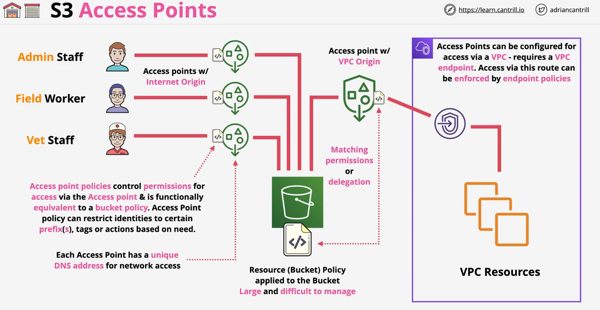

[Amazon S3 Access Points](https://docs.aws.amazon.com/AmazonS3/latest/userguide/creating-access-points.html#access-points-policies), a feature of S3, simplifies managing data access at scale for applications using shared data sets on S3. Access points are unique hostnames that customers create to enforce distinct permissions and network controls for any request made through the access point.

- Simplify managing access to S3 Buckets/Objects
- By default, 1 bucket with 1 bucket policy
    - create many access points
    - each with different policies
    - each with different netwrork access controls
- Each  access point has its own endpoint address
- [as s3control create-access-point](https://docs.aws.amazon.com/cli/latest/reference/s3control/create-access-point.html) - cli or console
    ```bash
    aws s3control create-access-point \
        --account-id 123456789012 \
        --bucket business-records \
        --name finance-ap

    ```
