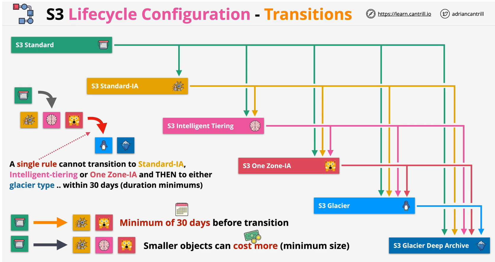

### S3 Lifecycle Configuration
- Set of rules on  a bucket or groups of objects
    - Actions - tranisition or expiration
- Cost management to automatically move one storage class to another or expire objects when no longer needed
- Downward directions for transition

**considerations**

- **smaller objects** can **cost more** - minimumm size limitation
- **Minimum of 30 days** in standard before transition
- Single rule cannot transition from **Starndard-IA** to **S-IA,, intelligent or OneZone-IA** and then to either **glacier type** .. within 30 days (duration minimums)
        - Two different rules can achive this 
  
