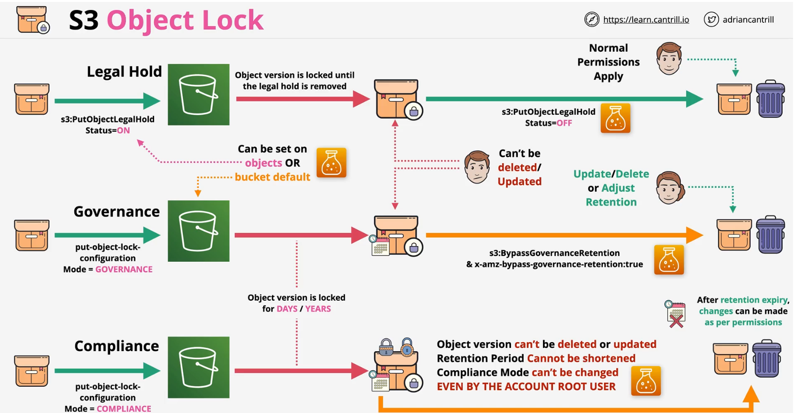

### Overview

- Object Lock enabled on `new` buckets 
    - existing bucket needs to go via AWS request support
    - `versioning` is enabled by default and once object lock is enabled, `versioning` cannnot be supspended or diabled the object lock
- **WORM** - Write Once Read Many
    - No Delete, No Overwrite
-  Requires versioning - `invdividual versions` are locked
-  Can have **both**, **one or the other**, or none
      -  **Retention Period**
      -  **Legal Hold**
- A bucket can have **default Object Lock Settings**

### Retention
- Specify **DAYS** & **YEARS** - A Retention Period

1. **COMPLIANCE** - Can't be adjusted, deleted, overwritten
    -  not even by the root user
    - until the rentention period expires
    - for compliance - financial records

2. **GOVERNANCE** - special **pemissions** can be granted allowing lock settings to be adjusted
    - `s3:BypassGovernanceRetention` - access
    - `x-amz-bypass-governance-retention:ture`
    - accidental deletion, testing mode for compliance mode

### Legal Hold
- Set on a **object version** - either ON or OFF
    - no retention
- NO Deletes or Changes until removed
- `s3:PutObjectLegalHold` is required to add or remove
- Prevent accidental deletion of critical object versions

 

