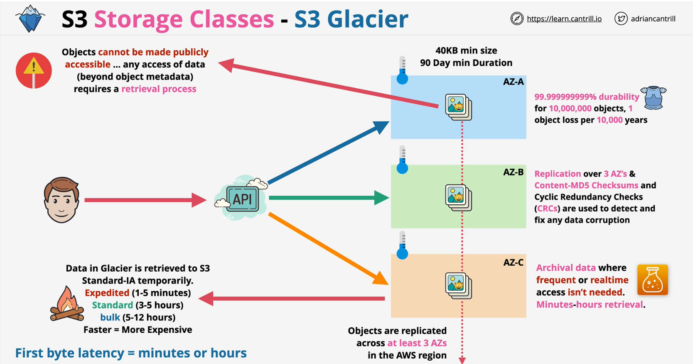
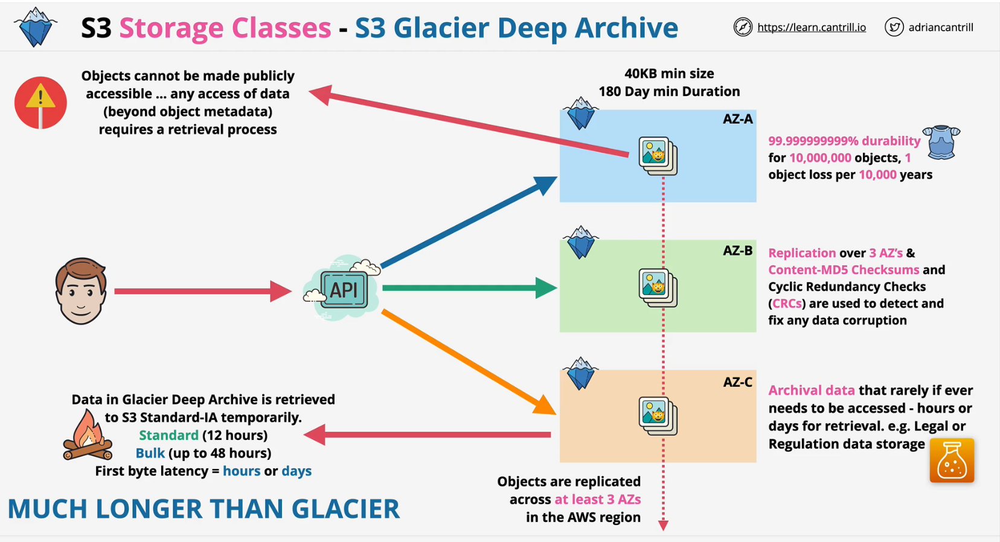
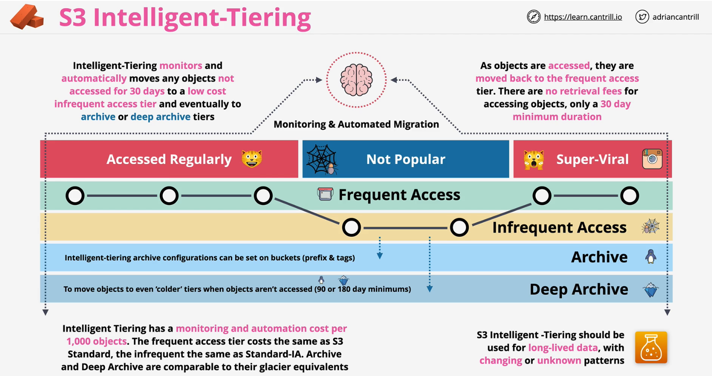

### Storage Object Classes
- By default, objects are replicated across **at least 3 AZs**
- **200 OK** for successful response
- **TRANSFER IN** is free but **$ per GB is charged for TRANSFER OUT** + **a price  per 1000 requests**

#### Comparing the Amazon S3 storage classes
| Storage class | Designed for | Durability \(designed for\) | Availability \(designed for\) | Availability Zones | Min storage duration | Min billable object size | Other considerations  | 
| --- | --- | --- | --- | --- | --- | --- | --- | 
|  S3 Standard  |  Frequently accessed data \(more than once a month\) with millsecond access  |  99\.999999999%   |  99\.99%  |  >= 3  |  None  |  None  |  None  | 
|  S3 Standard\-IA  |  Long\-lived, infrequently accessed data \(once a month\) with millisecond access  |  99\.999999999%   |  99\.9%  |  >= 3  |  30 days  |  128 KB  |  Per GB retrieval fees apply\.   | 
|  S3 Intelligent\-Tiering  |  Data with unknown, changing, or unpredictable access patterns  |  99\.999999999%  |  99\.9%  |  >= 3  |  None  |  None  |  Monitoring and automation fees per object apply\. No retrieval fees\.  | 
|  S3 One Zone\-IA  |  Recreatable, infrequently accessed data \(once a month\) with millisecond access  |  99\.999999999%   |  99\.5%  |  1  |  30 days  |  128 KB  |  Per GB retrieval fees apply\. Not resilient to the loss of the Availability Zone\.  | 
|  S3 Glacier Instant Retrieval  | Long\-lived, archive data accessed once a quarter with millisecond access | 99\.999999999%  |  99\.9%  |  >= 3  |  90 days  |  128 KB  | Per GB retrieval fees apply\. | 
|  S3 Glacier Flexible Retrieval  | Long\-lived archive data accessed once a year with retrieval times of minutes to hours | 99\.999999999%  |  99\.99% \(after you restore objects\)  |  >= 3  |  90 days  |  40 KB  | Per GB retrieval fees apply\. You must first restore archived objects before you can access them\. For information, see [Restoring an archived object](restoring-objects.md)\. | 
|  S3 Glacier Deep Archive  | Long\-lived archive data accessed less than once a year with retrieval times of hours | 99\.999999999%  |  99\.99% \(after you restore objects\)  |  >= 3  |  180 days  |  40 KB  | Per GB retrieval fees apply\. You must first restore archived objects before you can access them\. For information, see [Restoring an archived object](restoring-objects.md)\. | 
|  RRS \(not recommended\)  |  Noncritical, frequently accessed data with millisecond access  |  99\.99%   |  99\.99%  |  >= 3  |  None  |  None  |  None  | 

### S3 Standard, Standard IA, S3 One Zone-IA

### S3 Glacier
- Objects cannot be made publicly accessible
    - any access of data (beyond object metadata) requires a retrieval process

### S3 Intelligent-Tiering

